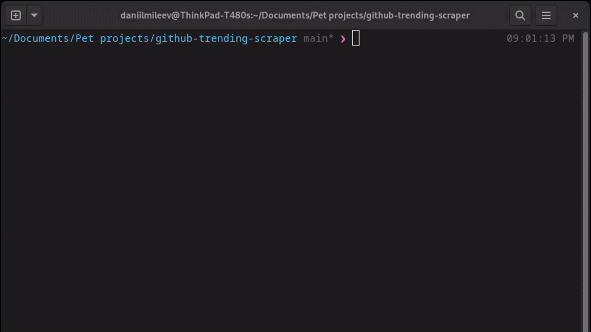

# Github trending scraper

Simple CLI tool which can return top N repositories from [Github trending page](https://github.com/trending).

## How to use
Just run `./gts` command from terminal.  
Tool has 3 flags:  
1. `top_n` - Top n repositories to show. `by default 5`
2. `lang` - Programming language to show. `by default Go =)`
3. `since` - Date range. Can be `daily`, `weekly`, `monthly`. `by default weekly`

## Here example
